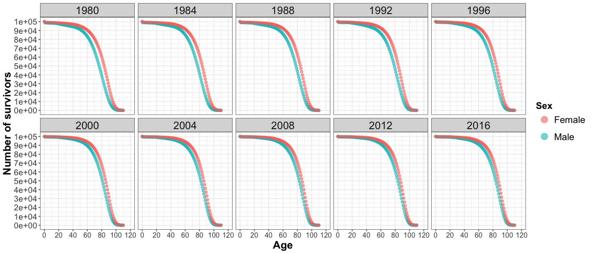
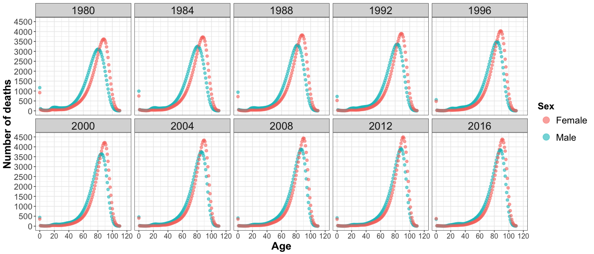

## Overview

In this report, I will be visualizing the life expectancy dataset, starting with BC.

## What story can we tell with this dataset? 

How does this worksss? ugh

## British Columbia 

### Number of survivors at age x 

<!-- -->

### Number of deaths at age x 

<!-- -->
